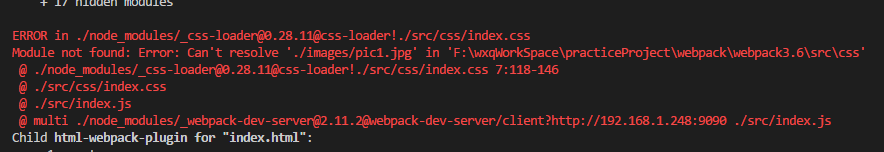
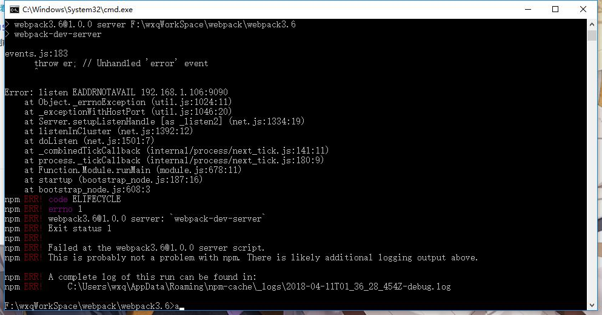

# webpack3.x 学习笔记

*学习文章：* <http://jspang.com/2017/09/16/webpack3-2/>  
*webpack文档：*  <https://doc.webpack-china.org/concepts/>

**目录**

* [1.安装webpack](#1.安装webpack)  
* [2、监听和入口出口](#2、监听和入口出口)  
* [3、服务和热更新](#3、服务和热更新)  
* [4、打包css文件](#4、打包css文件)  
* [5、压缩js代码](#5、压缩js代码)  
* [6、打包html文件](#6、打包html文件)  
* [7、图片大坑](#7、图片大坑)  
* [8、增加babel支持（es6,es7语法转换）](#8、增加babel支持（es6,es7语法转换）)  
* [常见报错集锦](#常见报错集锦)  

- ### 1、安装webpack

    npm 初始化

        npm init    // 需要输入项目名称、版本号、项目描述、作者等等..
        npm init -y // 选项都是默认内容，不用一个个输入，后续需要修改直接在package.json文件改就行了

    *注：npm在国内下载安装模块太慢，可以换成cnpm(淘宝npm镜像)

        npm install -g cnpm --registry=https://registry.npm.taobao.org

    本地安装

        npm install --save-dev webpack
        npm install --save-dev webpack@<version>

        //说明: --save代表把这个模块保存到package.json里面， -dev代表用于开发环境

    全局安装(不建议全局安装webpack,后面有坑)

        npm install --global webpack //安装
        npm uninstall webpack -g    // 卸载
    
    **附：**  
    如果是最新版本4.5的话， 运行`webpack -v` 查询webpack版本号的时候，会显示是否安装 *webpack-cli* ,  
    运行 `npm install -D webpack-cli` ，  
    完成之后还是会报错，还是需要全局安装一下，在运行 `npm install -g webpack-cli` ，  
    最后 `webpack -v` 版本号出来了，完美~
    
    ---

- ### 2、监听和入口出口

    #### 2.1 页面监听(古老方法，后续有webpack自带的服务介绍)

        // 简单粗暴型
        npm install live-server -g //全局安装
        live-server // 自动在浏览器打开查看，默认地址 http://127.0.0.1:8080

    #### 2.2 基础打包
    
    **无配置webpack.config.js文件**
    
    3.x

        webpack src/entery.js dist/bundle.js
        // src/entery.js 入口文件
        // dist/bundle.js 出口文件
    
    4.x

        webpack --mode=development  // 无配置webpack.config.js文件的情况下，借助webpack-cli
        // index.js 入口文件
        // main.js 出口文件 
    

    **配置webpack.config.js**
    
    只需要运行 `webpack` 即可打包成功

        const path = require('path');
        module.exports = {
            mode: 'development', // development(开发环境)或者production(生产环境)
            /* entry入口文件
             * entry 属性的单个入口语法,还有多个入口的，详情请看文档
            */
            entry: {
                entry: './src/entry.js'
            },

            // output 目标输出
            output: {
                path: path.resolve(__dirname, 'dist'), // 目标输出绝对路径
                filename: 'bundle.js'
            },
        }
     
    ---

- ### 3、服务和热更新

    安装命令 `npm install webpack-dev-server --save-dev`

    在webpack.config.js里面配置服务devServer

        const config = {
            devServer: {
                contentBase: path.resolve(__dirname, 'dist'), //入口路径
                host: '192.168.1.106', // 本机ip地址
                compress: true, // 服务压缩，一般设置为true
                port: 9090  //端口，随便设置
            } 
        }

    在package.json文件里面配置简短别名
        
          "scripts": {
                "dev": "webpack-dev-server"  // 监听
            },
            // 注： 'webpack-dev-server --open'  是直接打开入口页面到浏览器
    ---

- ### 4、打包css文件

    #### 4.1 css打包  
        
    `style-loader` 处理css文件中的url()等  
    `css-loader` 将css插入到页面的style标签  
    
        // css必须安装这两个loader
        cnpm install style-loader css-loader -D  // "-D"表示"--save-dev"

    loader配置，在wepack.congig.js文件下配置module

        const config = {
            module: {
                rules: [
                    {
                        test: /\.css$/,
                        use: ['style-loader', 'css-loader']
                    }
                ]
            }, 
        }    

    **loader还有以下的几种写法：**

    1.上面写的，直接传递字符串组， loader 属性的简写方式   
    2.把use换成loader

            const config = {
            module: {
                rules: [
                    {
                        test: /\.css$/,
                        loader: ['style-loader', 'css-loader']
                    }
                ]
            }, 
        }            

    3.use + loader属性的写法

        const config = {
            module: {
                rules: [
                    {
                        test: /\.css$/,
                        use: [
                            'style-loader',
                            {
                                loader: 'css-loader',
                                options: {
                                    importLoaders: 1
                                }
                            }
                        ]
                    }
                ]
            }, 
        } 

    #### 4.2 Less文件的打包和分离

    安装less

        cnpm i less -D // less服务
        cnpm i less-loader -D //loader打包使用

        // 一起安装
        cnpm i less less-loader -D

    loader配置  
    webpack.config.js

        module: {
            rules: [
                {
                    test: /\.less$/,
                    use: [
                        {
                            loader: "style-loader"
                        },
                        {
                            loader: "css-loader"
                        },
                        {
                            loader: "less-loader"
                        }
                    ]
                }
            ]
        },

    分离less插件

        cnpm i extract-text-webpack-plugin -D // 前面已安装过分离插件

    修改webpack.config.js

        module: {
            rules: [
                {
                    test: /\.less$/,
                    use: extractTextPlugin.extract({
                        use: [
                            {
                                loader: "css-loader"
                            },
                            {
                                loader: "less-loader"
                            }
                        ],
                    fallback: "style-loader"
                    })
                },
            ]
        }

    #### 4.3 sass文件的打包和分离

    sass的配置和less的差不多  

    安装模块

        cnpm i node-sass -D // sass-loader依赖no-sass,所以要先安装
        cnpm i sass-loader -D //loader打包使用

        // 一起安装
        cnpm i node-sass sass-loader -D

    loader配置  
    webpack.config.js

        module: {
            rules: [
                {
                    test: /\.scss$/,
                    use: [
                        {
                            loader: "style-loader"
                        },
                        {
                            loader: "css-loader"
                        },
                        {
                            loader: "sass-loader"
                        }
                    ]
                }
            ]
        },

    分离less插件

        cnpm i extract-text-webpack-plugin -D // 前面已安装过分离插件

    修改webpack.config.js

        module: {
            rules: [
                {
                    test: /\.scss$/,
                    use: extractTextPlugin.extract({
                        use: [
                            {
                                loader: "css-loader"
                            },
                            {
                                loader: "sass-loader"
                            }
                        ],
                    fallback: "style-loader"
                    })
                },
            ]
        }

    ---

    #### 4.4 自动处理css3属性前缀

    PostCSS是一个css处理平台，可以帮助css实现更多功能，使用autoprefixr插件可以使PostCSS拥有自动添加前缀的功能。更多PostCSS相关操作查看它的github地址：<https://github.com/postcss/postcss-loader>;

    安装

        cnpm i postcss-loader autoprefixer -D

    在根目录新建一个postcss.config.js文件（与webpack.config.js同级）

        module.exports = {
            plugins: [
                require('autoprefixer')
            ]
        }

    在webpack.config.js里配置loader(打包和分离)

        module: {
            rules：[  
                {
                    test: /\.css$/,
                    use: extractTextPlugin.extract({
                    fallback: 'style-loader',
                    use: [
                        {
                            loader: 'css-loader',
                            options: {
                                importLoaders: 1
                            }
                        },
                        {
                            loader: 'postcss-loader'
                        }
                    ]
                    })
                },
            ]
        }

    #### 4.5 消除未使用的css（减少css冗余）

    purifycss-webpack要依赖于purify-css,安装

    cnpm i purify-css purificss-webpack -D

    配置webpack.config.js

        const glob = require('glob'); // 引入node的glob对象，同步检测html模板，遍历文件，查找哪些css被使用了
        const purifyCSSPlugin = require('purifycss-webpack');

        plugins: [
            new extractTextPlugin('css/index.css'),
            new purifyCSSPlugin({
                paths: glob.sync(path.join(__dirname, 'src/*.html'))
            })
        ],

    **注意：**使用这个插件必须配合extract-text-webpack-plugin这个插件。

- ### 5、压缩js代码

    引用webpack内置插件

        const uglifyPlugin = require('uglifyjs-webpack-plugin');
    
    在webpack.config.js配置插件

        const config = {
            plugins: [
                new uglifyPlugin()
            ],
        }
    ---

- ### 6、打包html文件

    用cnpm安装包

        cnpm i html-webpack-plugin -D

    在webpack.config.js引用插件包

        const uglifyPlugin = require('uglifyjs-webpack-plugin');

    在webpack.config.js配置插件

        plugins: [
            new uglifyPlugin(),
            new htmlPlugin({
                minify:{ // minify对html文件进行压缩
                    removeAttributeQuotes:true // 去掉html属性值里面的双引号("");
                },
                hash:true, // 加入哈希值避免缓存问题
                template:'./src/index.html' // 打包的html模板路径和文件名字
            
            })
        ],
    ---

- ### 7、图片大坑

    #### 7.1 CSS中的图片处理

    由于缺少loader对图片的解析，会在终端报错，如下图：  

    

    所以需要安装loader

        cnpm i url-loader -D

    配置webpack.config.js文件

        const config = {
            module: {
                rules: [
                    {
                        test: /\.(png|gif|jpg|svg|jpeg)$/,
                        use: [
                            {
                                loader: 'url-loader',
                                options: {
                                    limit: 8192, // 把小于8192B的文件打成Base64的格式
                                    outputPath:'images/ ' // 输出的图片路径
                                }
                            }
                        ]
                    }
                ]
            },
        }    

    **url-loader：**  内置有file-loader, 当在图片较多的情况下，会发送非常多的http请求，降低页面页面性能，url-loader就可以解决这个问题，url-loader会将引入的小图片编码，生成dataURl。相当于把图片数据翻译成一串字符。再把这串字符打包到文件中，最终只需要引入这个文件就能访问图片了。  
    url-loader工作分为两种情况：  
    1. 文件大小小于limit参数，url-loader会将文件转成dataUrl(base64g格式);  
    2. 文件大小大于limit参数，url-loader会直接调用file-loader进行处理，参数也会传给file-loader。

    **file-loader：**  解决图片引用路径的问题，file-loader可以解析项目中的url引入（不仅限于css），它可以根据我们的配置，将图片拷贝到相应的路径，在修改打包后文件引用路径，使之指向正确文件。

    #### 7.2 CSS分离与图片路径处理

    **7.2.1 css分离插件**

        cnpm i extract-text-webpack-plugin -D

    webpack.config.js中配置

        const extractTextPlugin = require('extract-text-webpack-plugin'); // 引入
        module.exports = {
            module: {
                rules: [
                {
                    test: /\.css$/,
                    use: extractTextPlugin.extract({
                    fallback: "style-loader",
                    use: "css-loader" //用于将资源转换成一个 CSS 导出模块
                    })
                }
                ]
            },
            plugins: [
                new extractTextPlugin("css/index.css")
            ]
        }
    
    **7.2.2 图片路径问题**

    利用extract-text-webpack-plugin插件确实是可以把css完美分离出来，但是图片路径却不对，所以需要用到publicPath,在webpack.config.js里配置：

        // 声明website(本机ip或者是devServer设置的ip) **疑问？上线的项目咋整？**
        const website ={
            publicPath:"http://192.168.1.248:9090/"
        }
        module.exports = {
            output: {
                path: path.resolve(__dirname, 'dist'),
                filename: '[name].js',
                publicPath: website.publicPath
            }
        }
    
    #### 7.3 处理HTML中的图片

    解决在hmtl文件中引入\标签的问题

        cnpm install html-withimg-loader --save-dev
    
    在webpack.config.js配置

        module: {
            rules: [
                {
                    test: /\.(htm|html)$/i,
                    use:['html-withimg-loader']
                }
            ]
        },
    ---

- ### 8、增加babel支持（es6,es7语法转换）

    babel是一个编译javascript的平台，它可以通过编译达到以下目的：

    - 使用下一代的javascript代码（如es6,es7）,这些标准目前并未被当前浏览器完全支持；
    - 使用基于javascript进行扩展的语言，例如React的JSX.

    Babel的安装

    Babel是几个模块的包，其核心功能位于babel-core的npm包中。  
    安装依赖包：（babel-preset-env解析es6）

        cnpm i babel-core babel-loader babel-preset-env -D

    在webpack.config.js中配置loader
    
        {
            test:/\.(jsx|js)$/,
            use:{
                loader:'babel-loader'
            },
            exclude:/node_modules/
        }
        
    .babelrc配置

        {
            "presets":["react","env"]
        }

    或者直接在webpack.config.js中配置babel,建议把babel配置分开到.babelrc文件，如上所述。

        module: {
            rules: [
                {
                    test:/\.(jsx|js)$/,
                    use:{
                        loader:'babel-loader',
                        options:{
                            presets:[
                                "es2015","react"
                            ]
                        }
                    },
                    exclude:/node_modules/
                }
            ]
        }

    `babel-preset-es2015`也可以解析es6,但是网上已经不流行了，官方推荐使用`babel-preset-env`.
    babel-preset-es2015的配置方法和babel-preset-env差不多，只要把env改为es2015

        {
            "presets":["env"]
        }
    
---

- ### 常见报错集锦

    - 1.ip不正确或者端口被占用

        

        *注：在这种情况下要注意检查本机Ip是否写正确，端口是否被占用。(查看本机ip方法, win+R打开运行 -> 输入cmd -> 执行ipconfig)

